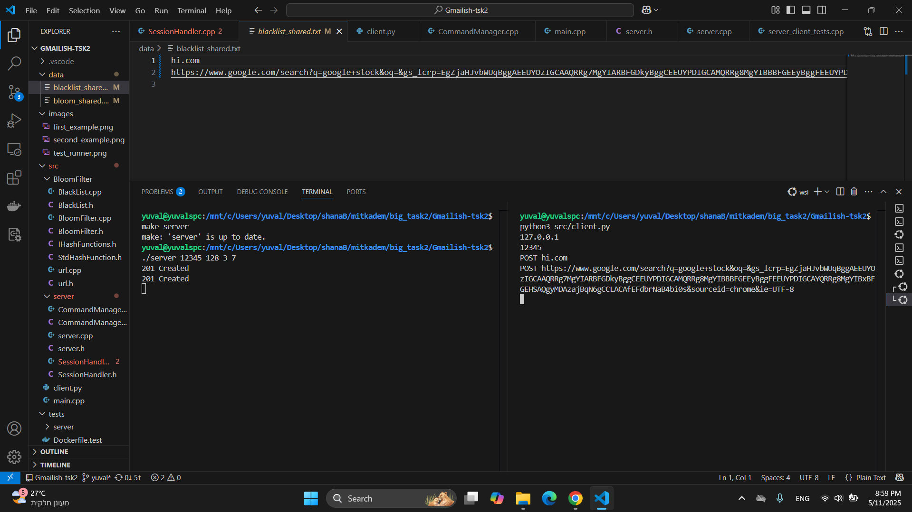
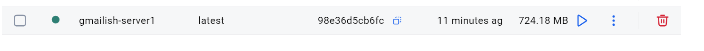
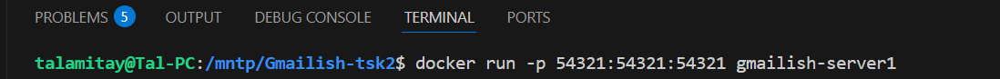
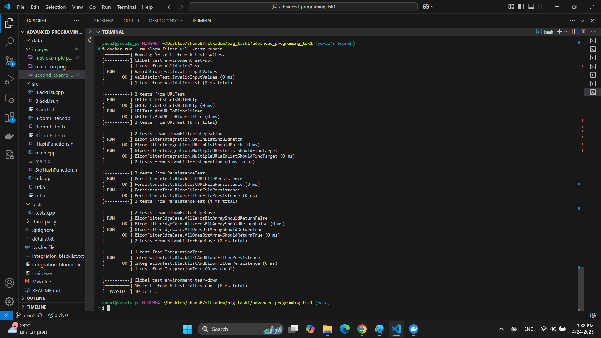

# Gmailish-tsk2: TCP-Based Bloom Filter URL Blacklist

## GitHub Repository

https://github.com/yuvaltar/Gmailish-tsk2.git

## Ex2 – Client-Server URL Blacklist Over TCP

This project builds on the work from Task 1, extending the Bloom Filter-based blacklist system into a **client-server architecture over TCP sockets**. The server is implemented in C++ and handles all business logic, while the client is written in Python 3 and serves as a lightweight interface for user input and output.

The project is designed with **SOLID principles** and **loose coupling**, ensuring easy extensibility for future changes. It supports persistent storage, clean protocol definitions, and modular command handling.

---

## How It Works

### Client (Python 3)

* Prompts the user for server IP and port.
* Connects once via TCP and keeps the connection open.
* Reads user commands from the console and sends them line-by-line to the server.
* Waits for server response and prints it before accepting the next command.
* Does not validate or interpret commands – forwards them as-is.

### Server (C++)

* Accepts a port number as argument and listens on a TCP socket.
* For each client connection, initializes a session handler.
* The first message from any client is a configuration line specifying the Bloom filter size and hash function iteration counts.
* All clients share a **single Bloom Filter and blacklist** in memory, updated by each session.
* The shared data is persisted across sessions to:

  * `data/bloom_shared.bin`
  * `data/blacklist_shared.txt`

---

## Supported Commands

| Command  | Format         | Description                               | Response Example                        |
| -------- | -------------- | ----------------------------------------- | --------------------------------------- |
| `POST`   | `POST <url>`   | Adds a URL to the Bloom and Blacklist.    | `201 Created\n`                         |
| `GET`    | `GET <url>`    | Checks if URL might exist (Bloom + list). | `200 Ok\n\ntrue true\n`                 |
| `DELETE` | `DELETE <url>` | Removes URL from the exact list only.     | `204 No Content\n` or `404 Not Found\n` |

Invalid or malformed commands return:

```text
400 Bad Request
```

---

## Persistence

A **single shared Bloom Filter and Blacklist** are used by all clients. Data is saved to disk after each valid modifying command:

* `data/bloom_shared.bin`
* `data/blacklist_shared.txt`

These files are loaded once when the first client session initializes.

---

## Building and Running

### Prerequisites

* C++17 compiler (e.g. `g++`)
* Python 3
* Make
* WSL or Linux (or MinGW/WSL on Windows)

### Build the Server

```bash
make clean
make
```

### Run the Server

```bash
./server 12345
```

### Run the Client

```bash
python3 src/client.py
```

Provide:

```
Server IP: 127.0.0.1
Server Port: 12345
```
It should look something like this (example run of the code via bash):


---

---


## Docker Support

You can also build and run the project using Docker.

### Build Docker image

```bash
docker build -t bloom-server .
```

### Run Server

```bash
docker run -it --rm -v "$PWD/data:/app/data" -p 12345:12345 bloom-server ./server 12345
```

### Run Client

Use your host machine to run the client script:

```bash
python3 src/client.py
```

(Connect to `localhost` and port `12345`)

---

This should look something like this:


---

---

---

## Running Tests

### Bash

To run tests from your terminal:

```bash
make test_runner
./test_runner
```

**Test Screenshot Example:**


### Docker

Run the test suite inside the container:

```bash
docker run --rm bloom-server ./test_runner
```

**Docker Test Screenshot Example:**


---

## Code Structure

```
Gmailish-tsk2/
├── data/                       # Shared Bloom filter and blacklist
├── images/                     # Screenshots for documentation
├── src/
│   ├── BloomFilter/            # BloomFilter logic, URL handling, hash functions
│   ├── server/                 # SessionHandler, CommandManager, TCP server
│   ├── client.py               # Python 3 client
│   └── main.cpp                # Entry point for server
├── tests/
│   ├── tests.cpp               # Core functionality tests
│   └── server_client_tests.cpp # Client-server interaction tests
├── third_party/                # GoogleTest submodule
├── .gitignore
├── .gitmodules
├── Dockerfile                  # Docker setup
├── Makefile                    # Build instructions
├── README.md
├── details.txt                 # Project metadata
├── server                      # Compiled server binary
└── test_runner                 # Compiled test runner
```

---

## SOLID and Extensibility Discussion

This project was refactored to improve maintainability, modularity, and separation of concerns — particularly in preparation for its evolution into a client-server model.

| Change Type                                       | Did It Require Code Change? | Why or Why Not?                                                                                                 |
|--------------------------------------------------|------------------------------|------------------------------------------------------------------------------------------------------------------|
| **Command names changed (e.g., `1` to `POST`)**  |  Yes                         | Originally hardcoded in `main.cpp`. In Task 2, parsing was abstracted into `CommandManager` for flexibility.    |
| **New commands added (e.g., `DELETE`)**          |  Yes                         | Required expanding `CommandManager` with new logic. Modular design now allows easier addition of new commands. |
| **Response formatting changed**                  |  Yes                         | Previously printed directly in `main.cpp`. Now formatted consistently inside `CommandManager::execute()`.       |
| **Switched from console I/O to sockets**         |  Yes                         | Required full redesign: input/output now handled in `SessionHandler`, with blocking socket reads and sends.     |

---

## Future-Proof Design

* All logic modules (BloomFilter, BlackList, CommandManager) are fully decoupled from networking.
* The code separates data management, protocol parsing, and socket transport.
* Each component is tested independently.

This ensures we are **closed to changes, but open to extension**.

---

## Authors

Yuval Tarnopolsky, Tal Amitay, Itay Smouha
