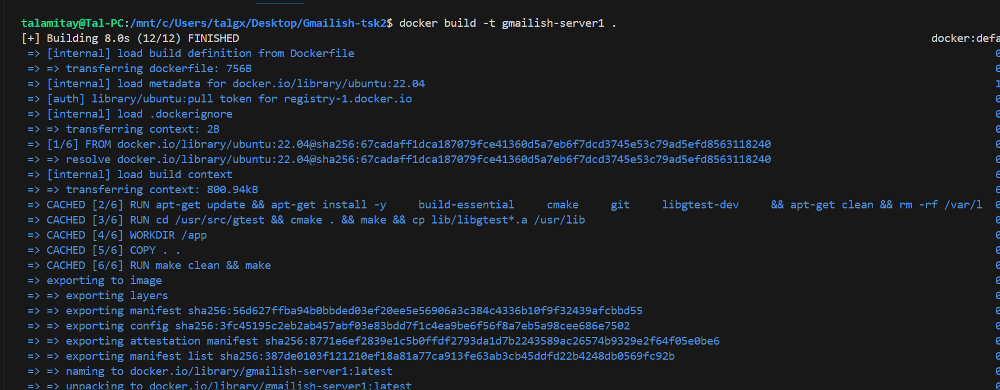
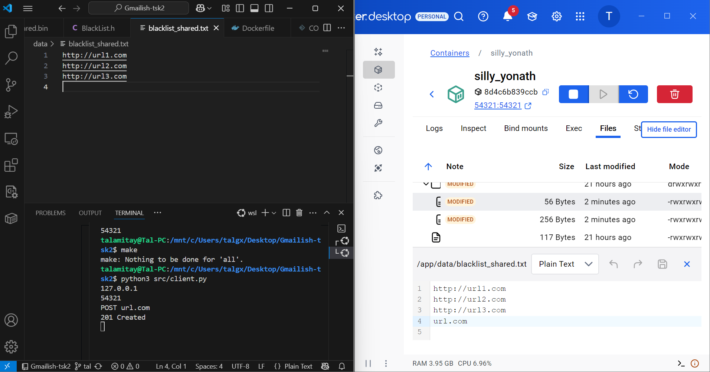
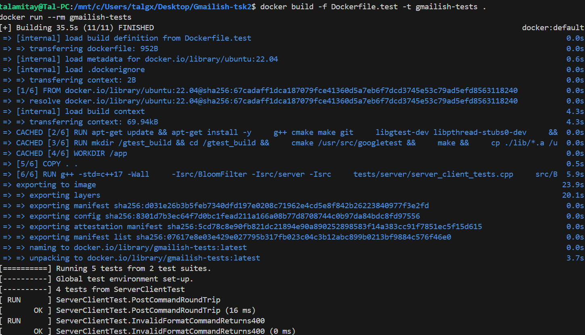
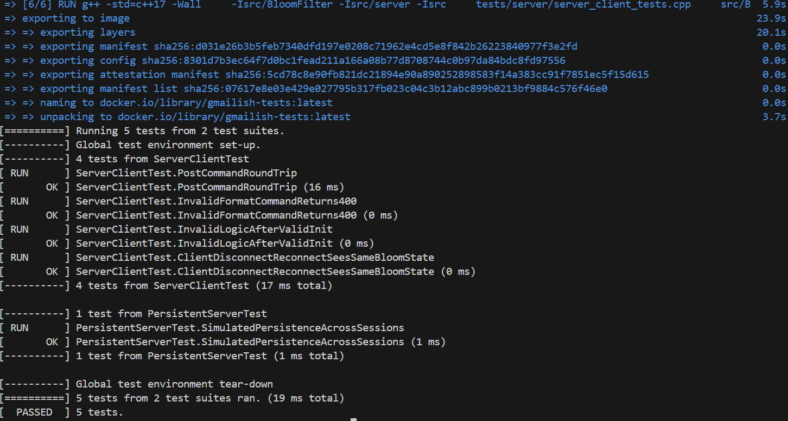

# Gmailish-tsk2: TCP-Based Bloom Filter URL Blacklist


## GitHub Repository

https://github.com/yuvaltar/Gmailish-tsk2.git


## Table of Contents
- [Overview](#overview)
- [Features](#features)
- [How It Works](#how-it-works)
  - [Client (Python 3)](#client-python-3)
  - [Server (C++)](#server-c)
- [Supported Commands](#supported-commands)
- [Persistence](#persistence)
- [Building and Running](#building-and-running)
- [Docker Support](#docker-support)
- [Running Tests](#running-tests)
- [Code Structure](#code-structure)
- [SOLID Principles](#solid-and-extensibility-discussion)
- [Jira Link](#jira-link)
- [Authors](#authors)

---

## Overview

This project implements a TCP-based client-server application for **URL blacklisting** using a **Bloom Filter** — a space-efficient probabilistic data structure that supports fast membership checks with no false negatives.

The client (Python) sends user commands, while the server (C++) maintains a shared Bloom Filter and blacklist. Commands like `POST`, `GET`, and `DELETE` are supported. The state persists across sessions.

---

## Features

- ✅ Efficient URL lookup via Bloom Filter  
- ✅ Shared in-memory state for all client sessions  
- ✅ TCP-based communication using sockets  
- ✅ Persistent storage with auto-load support  
- ✅ Modular C++ design with Python frontend  
- ✅ Dockerized setup for ease of deployment  
- ✅ Adheres to **SOLID principles**  

---

## How It Works

### Client (Python 3)

- Prompts for IP and port.
- Connects over TCP and remains connected.
- Sends user commands line-by-line.
- Prints server responses.
- Does **not validate or preprocess commands** — simply forwards them.

### Server (C++)

- Accepts port number via command line.
- Uses `SessionHandler` to manage input/output per session.
- All sessions share:
  - **One Bloom Filter**
  - **One URL blacklist**
- Data is persisted after every `POST` or `DELETE`.

---

## Supported Commands

### POST  
Adds a URL to both the Bloom Filter and blacklist.

**Format:**  
`POST www.example.com`  

**Output:**  
`201 Created`

---

### GET  
Checks if a URL might be blacklisted.

**Format:**  
`GET www.example.com`  

**Output:**  
```
200 OK

true true
```

- `true true`: In Bloom filter AND in exact list.  
- `true false`: In Bloom filter but not in list.  
- `false`: Definitely not in filter.  

---

### DELETE  
Removes a URL from the exact blacklist only.

**Format:**  
`DELETE www.example.com`  

**Output (success):**  
`204 No Content`  

**Output (not found):**  
`404 Not Found`  

---

### Invalid Input

Any malformed or invalid command returns:  
`400 Bad Request`

---

## Persistence

A **single shared Bloom Filter and Blacklist** are used by all clients. Data is saved to disk after each valid modifying command.

- **Files:**
  - `data/bloom_shared.bin` — serialized Bloom Filter
  - `data/blacklist_shared.txt` — plain-text blacklist

- **Behavior:**
  - Data loads once on the first session's initialization.
  - Any `POST` or `DELETE` automatically triggers saving.

These files are loaded once when the first client session initializes.

---

## Building and Running

### Requirements

- C++17
- Python 3
- `make`
- Linux / WSL / MinGW

### Build Server

```
make clean
make
```

### Run Server

```
./server 12345 128 3 7
```

### Run Client

```
python3 src/client.py
```

You’ll be prompted for:

```
Server IP: 127.0.0.1  
Server Port: 12345
```

### Client Example:


### Server Example:


---

## Docker Support

### Build Server Image

```
docker build -t gmailish-server1 .
```
  
---

It should create an imae in the docker that looks like this:


---

### Run Server Container

```
docker run -p 54321:54321 gmailish-server1 54321 256 8 16
```

- `54321` is the port
- `256` is Bloom filter size
- `8` and `16` are hash function seeds

### Run Client (outside Docker)

```
python3 src/client.py
```



---

Explanation:

The server was run via Docker rather than locally. Therefore the addition of the url "url.com" was updated in the data file "blacklist_shared.txt" in the docker and not in the local file where the client was run.

## Running Tests

### Bash

```
make test
./test_runner
```


---

### Docker

```
docker build -f Dockerfile.test -t gmailish-tests .
docker run --rm gmailish-test
```

  


---

## Code Structure

```
Gmailish-tsk2/
├── data/
├── images/
├── src/
│   ├── BloomFilter/
│   ├── server/
│   ├── client.py
│   └── main.cpp
├── tests/
│   ├── tests.cpp
│   └── server_client_tests.cpp
├── third_party/
├── .gitignore
├── .gitmodules
├── Dockerfile
├── Makefile
├── README.md
├── details.txt
├── server
└── test_runner
```

---

## SOLID and Extensibility Discussion

| Change | Required Refactoring? | Justification |
|--------|------------------------|----------------|
| `1`, `2`, commands to `POST`, `GET` | ✅ Yes | Now parsed in `CommandManager` using string mapping instead of hardcoded numeric commands. |
| Added `DELETE` command | ✅ Yes | Required expanding `CommandManager` with new logic. Modular design now allows easier addition of new commands. |
| New response formatting | ✅ Yes | Now centralized inside `CommandManager::execute()`. |
| Socket-based I/O | ✅ Yes | I/O logic moved from `main.cpp` to `SessionHandler`. Modular design kept the logic layer unchanged. |


---

## Future-Proof Design

* All logic modules (BloomFilter, BlackList, CommandManager) are fully decoupled from networking.
* The code separates data management, protocol parsing, and socket transport.
* Each component is tested independently.

This ensures we are **closed to changes, but open to extension**.

---

## Jira Link

Project planning and task tracking are managed in Jira.  
View the board here:  
**[Jira: GIT2 Project Board](https://yuvaltarno1337.atlassian.net/jira/software/projects/GIT2/boards/67)**

---

## Authors

- Yuval Tarnopolsky  
- Tal Amitay  
- Itay Smouha
